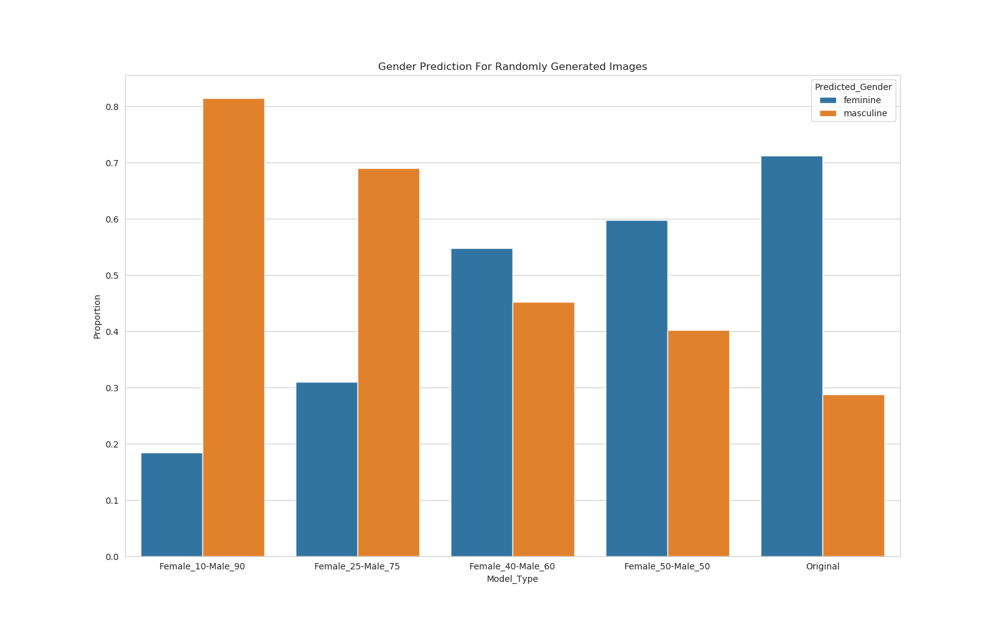
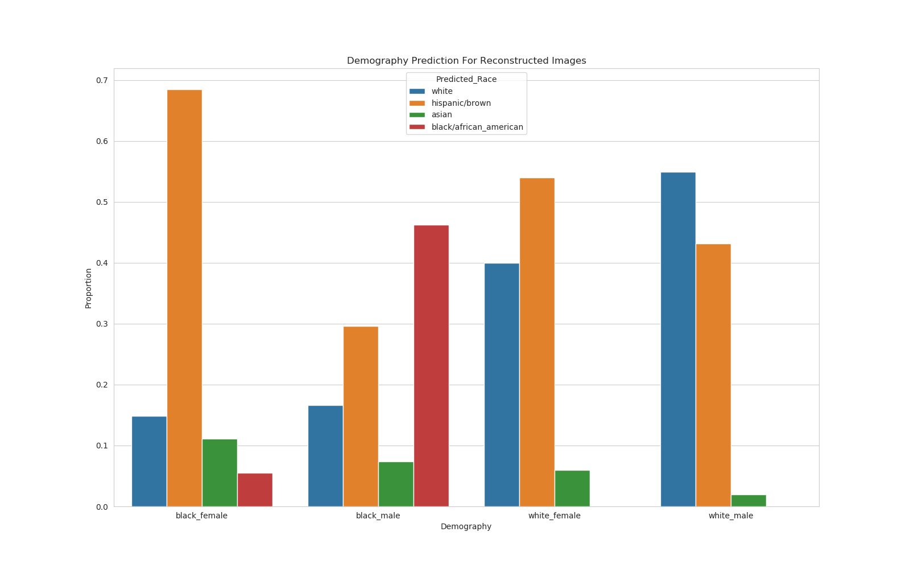
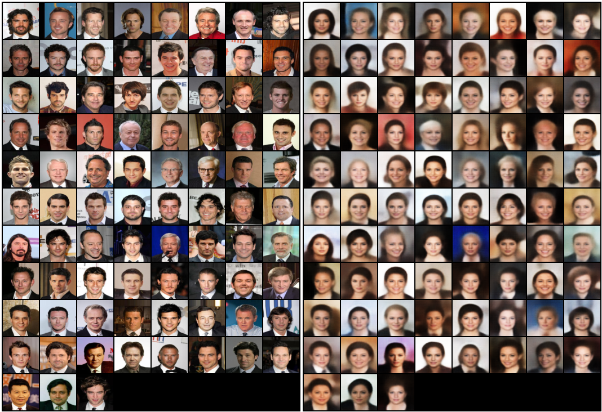
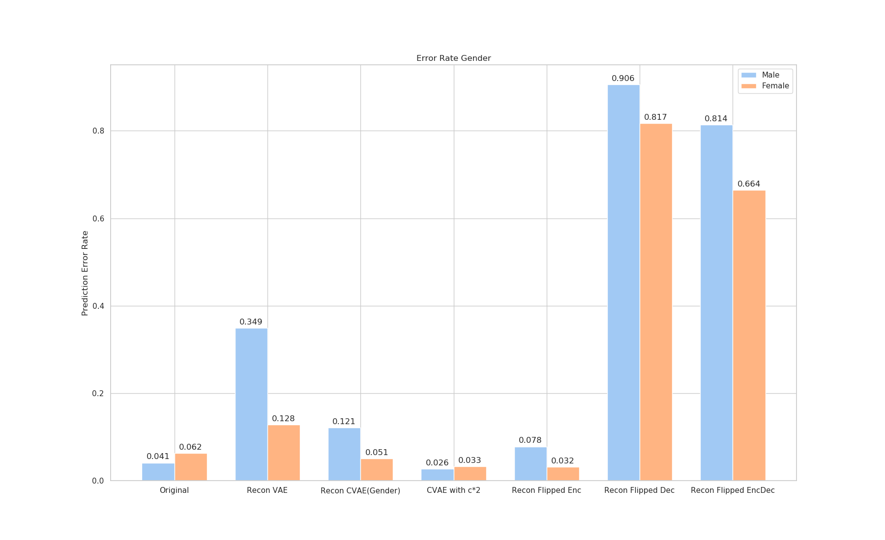

The project was carried out while I was a research assistant at the Max Planck Institute for Software Systems. The project explored the new direction of looking for potential bias in generative models. Models like variational autoencoders and GANs are becoming quite popular and also seeing deployment. The project aims to see if such models can exhibit any notion of bias. In particular, we explore variational autoenccoders and how the data that is generated or reconstructed by such models can be biased to certain demographics. 
The bias is attempted to be formally defined. The project also involves initial exploration for methods to de-bias such systems, e.g. using additional labels to supervise the training process of the generative models.

## A. Exploring generated images of VAE
We train a standard VAE model on the CelebA dataset and use the model to generate new facial images.
We explore the generated images for any potential bias, and perform this experiment by varying the population's gender ratio.
Note the original data has a female-male ratio of 52-48.
We predict gender using the [Clarifai](https://www.clarifai.com/) API.

*We use these only for research purposes. The CelebA dataset has several issues that have been discussed in the broader literature. Moreover, the moral implications of performing gender prediction from facial images should be looked into in more detail. We also do not assume perfect performance of the Clarifai API.*
- Note how with original data, there is a clear bias of the model towards generating feminine faces. 
- Even when Male to Female ratio in training data is equalized, there is a bias towards feminine faces.
- The most equality for gender in the generated sample distribution is when we give more Male training photos (60%)!

So clearly, even with equalized data, a standard VAE can generate *biased* data.

## B. Auditing reconstructed data of VAE
Using the trained VAE again, we now use a curated auditing set created from the CelebA test data.
The audit set is the intersection of gender (male-female) and race (black/african american-white/caucasian).
For each face, we use the VAE to reconstruct the face again (feed it as input and analyze the output).
We then use the Clarifai API to predict the demographics of the reconstructed faces.

*The use of machine learning to predict demographics from facial data, and its implications need further study. We only use this here for an initial research insight.*
- Surprisingly here, male faces (white and black) are more likely to have the demography correctly predicted.
- Black females suffer the most, where almost all the faces are predicted as Hispanic instead.
- White females also suffer, but nowhere as poorly as black females.

So, the VAE clearly suffers from some bias in reconstructing data. The way that it reconstructs demographic information in the faces is very different for different groups.

## C. Generating counterfactual images with Conditional VAE
We now start exploring some potential fixes. First, we assume that the facial data has gender labels available (it is the case for CelebA).
Then, we train a Conditional VAE model, conditioned on gender.
This actually allows us to generate counterfactual facial images!
1. Take an input image (say of a male) and feed it to the Encoder of the VAE.
2. Extract latent z.
3. Flip the conditional attribute from male to female at the Decoder of VAE.
4. Reconstruct the face image using the z and conditional Female.

We show some examples here, where we generate counterfactual female faces for some male face images.
It is interesting to note what the VAE learns to transform in this counterfactual generation.

E.g., the VAE smoothens the skin, applies makeup to the faces whenever we make counterfactual females.

## D. Effect of conditioning VAE on gender prediction of reconstructed images
We test how a standard VAE and conditional VAE generate images, specifically with respect to the gender.
So, we reconstruct input images using different VAE training procedures and use the Clarifai API to see how the gender errors look like.
We also play around with the conditional gender values in the models to see how the image reconstructions are perceived by the API.
- For the original CelebA images, the API makes more mistakes on Female faces than Male faces.
- If we use a standard VAE, the error is significantly higher for Males than Females. So masculine faces are reconstructed to be less masculine.
- Using a conditional VAE **significantly** reduces this bias. The error rates are much more equalized across genders.
- If we multiply the conditional values during reconstruction (so instead of conditional Female=1 we say Female=2), the error rates become even lower.
- So, multiplying the conditional can make the VAE generate more masculine/feminine faces (at least perceived by the API).
- Flipping the gender value at the encoder has no effect, so it does not generate counterfactuals. *This is as expected*.
- Flipping the gender value at the decoder however indeed seems to create proper counterfactuals. These images are almost always predicted to have the **opposite** gender of the input. 
- So, male input with flipped gender at decoder will always make the API think the reconstructed image is female.

<b>This project was done in collaboration with Preethi Lahoti, Junaid Ali, Till Speicher and Krishna Gummadi.</b>

