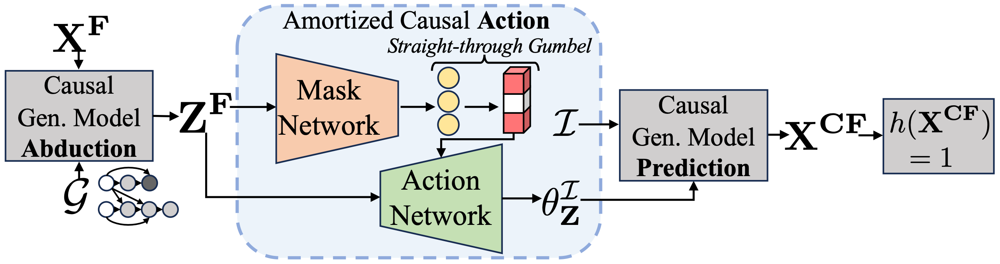
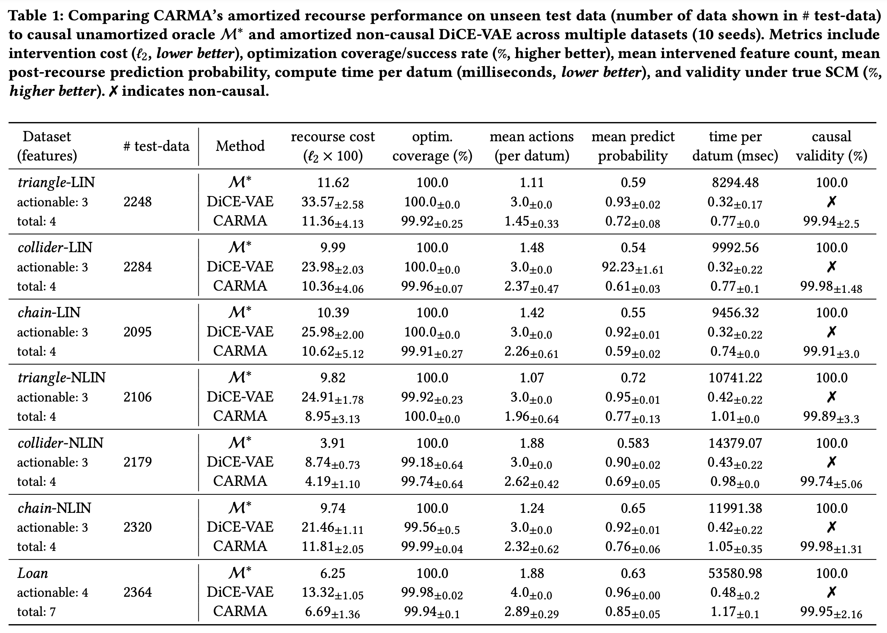
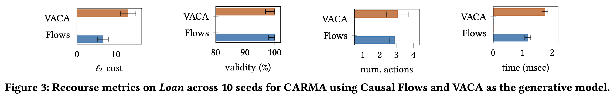
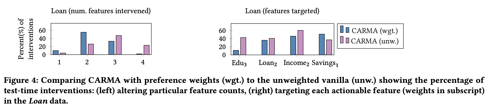

The project represents our recent [ACM FAccT 2024](https://facctconference.org/2024/index.html) paper.
Algorithmic recourse aims to provide explanations to automated algorithmic decision-making systems to enable end-users to understand what needs to be done to change the algorithm's prediction.
To this end, causal recourse showed that using the causal knowledge of the features is vital to ensuring the recommendations are actionable by people while being optimal in terms of cost of feature changes.
However, causal recourse has two major practical limitations: i) it requires perfect causal knowledge to compute counterfactual outcomes of its causal recommendations, ii) it needs to solve separate combinatorially complex optimization problems for each person seeking recourse.
Hence, for large-scale automated systems, e.g., online applications that provide instantaneous automated lending decisions or instantly filter out CVs in hiring, causal recourse cannot be directly applied.
In this work, we introduce CARMA, a practical framework that i) incorporates the power of the latest causal generative models with ii) neural networks that solve a novel amortized predictive formulation of the separate combinatorial problems.
Using this practical approach, we show that CARMA can help scale up causal recourse to enable instantaneous, actionable, and optimal recourse recommendation generation.

## A. Limitations of existing causal recourse techniques
Consider large-scale predictive settings, e.g., online automated lending systems, that instantaneously filter out and reject loan applicants.
Causal recourse can help provide helpful and actionable recommendations that users can use to overturn negative decisions.
For each individual with features $\mathbf{x}^{\mathrm{F}}$ requesting recourse, causal algorithmic recourse finds the optimal action $\boldsymbol{a}^{\*}$ that generates the counterfactual features $\mathbf{x}^{\mathrm{CF}}$ and obtains the positive prediction from the downstream classifier $h$. Causal recourse finds the optimal solution by solving the following optimization problem 
$$
\begin{align}
\boldsymbol{a}^* \in \underset{\boldsymbol{a} \in \mathcal{A}\left(\mathbf{x}^{\mathrm{F}}\right)}{\arg \min } \operatorname{cost}\left(\boldsymbol{a} ; \mathbf{x}^{\mathrm{F}}\right) \text { subj.to } h\left(\mathbf{x}^{\mathrm{CF}}\left(\boldsymbol{a}, \mathbf{x}^{\mathrm{F}}\right)\right)=1
\end{align}
$$
Unfortunately, there are two major limitations that limit the practicality of causal recourse.
1. We need to know the exact causal relations between the features $X$ (the exact structural causal model or SCM). Unfortunately, this is infeasible for most practical settings.
2. The optimization problem needs a combinatorial search over the set of all actions $\mathcal{A}$ that involves all feature and value combinations. Unfortunately, this becomes exponentially more complex for large-scale settings, increasing compute times.
Owing to these limitations, we cannot deploy causal recourse for practical large-scale settings so that we can provide causal recommendations for recourse instantaneously.
## B. Amortizing causal recourse optimization with CARMA
First, to enable providing causal recommendations even when we do not know the exact SCM for a practical scenario, we leverage existing causal generative models like the Causal Normalizing Flows.
With data of observed features and knowledge of only the causal graph, these powerful generative models allow CARMA to accurately estimate causal relations, causal exogenous factors $\mathbf{Z}^{\mathrm{F}}$ and compute counterfactual features.
CARMA incorporates pre-trained causal generative models and is flexible to use any recent and future models that allow gradient access.

Secondly, note that the causal relations between the features and the downstream classifier are, in fact, common and shared across the entire population. 
This enables us to convert the separate combinatorial optimization problems into a single predictive task to generate optimal recourse actions. Moreover, we can easily use observed data of features of individuals and train a neural network based framework to learn to generate these recommendations.
CARMA trains two NN models end-to-end: the mask network predicts which features $\mathcal{I}$ to intervene on and the action network predicts the optimal intervention values.

## C. CARMA provides recourse that is optimal and instant
We apply CARMA as the deployed causal recourse recommendation provider for various causal datasets and the semi-synthetic Loan dataset.
We compare CARMA to the Oracle that has access to the exact SCM for each dataset and solves the separate combinatorial problems to find causal recommendations.
In our results, we show that CARMA, despite amortization, can provide recourse recommendations that are optimal regarding the oracle in terms of the cost and the causal validity of the recommendations.
Moreover, amortization allows CARMA to significantly reduce the time required to generate the causal recommendations, leading to the possibility of instantaneous recourse suggestions.

## D. CARMA is flexible in using different generative models
In our evaluations, we train and deploy CARMA using not only the causal normalizing flows generative model, but also VACA that uses graph neural networks.
We show in our results that we can train and deploy CARMA using these two different architectures of generative models. Naturally, the Flows model performs better since it was shown to be the state-of-the-art.
Nonetheless, our results confirm that CARMA is flexible and can be incorporated with off-the-shelf causal generative models as long as we can compute gradients through these models (note that this is mostly possible since the models are based on deep neural networks).

## D. CARMA can incorporate population-level feature preferences
CARMA's formulation also allows us to easily incorporate knowledge of feature preferences that a population might have.
For instance, a population may find changing Education level very difficult but increasing Savings to be relatively simpler.
It is easy to incorporate this knowledge in the optimization of the mask and action networks of CARMA.
In our analysis on the Loan dataset where higher numbers for a feature represents more difficult features, we see that CARMA updates its recourse recommendations by leveraging the population preferences.
For instance, note that with the weights (wgt.), CARMA intervenes on fewer features and changes the more preferred features like Savings a lot more.

