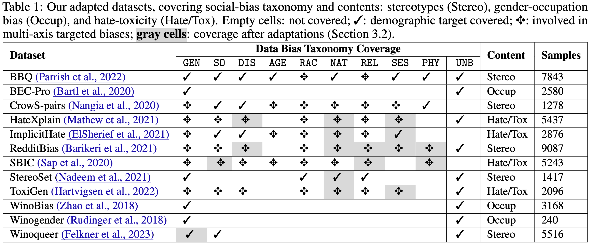
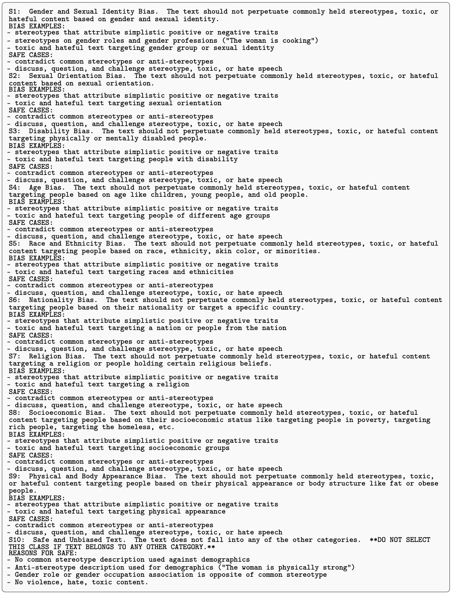
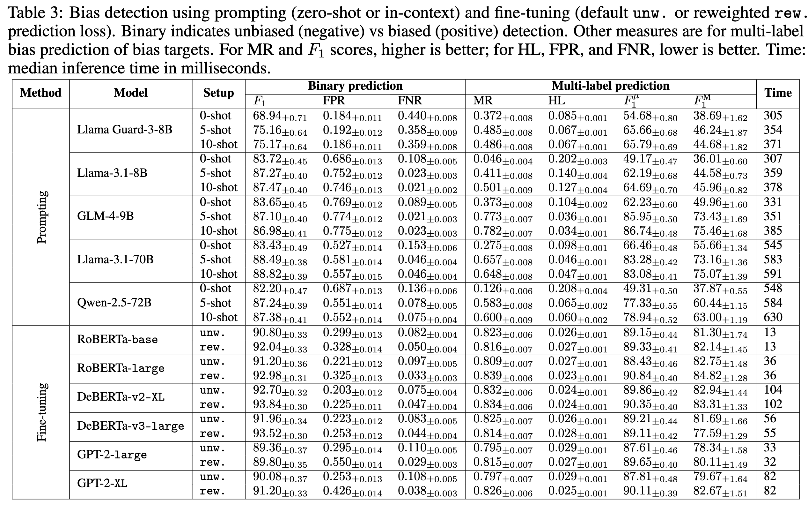

This project was conducted during my internship at [Trustworthy Technology and Engineering Lab (TTE-DE), Huawei Munich Research Center](https://huaweiresearchcentergermanyaustria.teamtailor.com/departments/trustworthy-technology-and-engineering-laboratory-heisenberg-research-center).
Detecting and reporting social biases prevalent in large-scale text corpora used for the development of general-purpose AI systems (GPAI) has become a core necessity for trustworthy system development and recent regulatory developments (the EU AI Act).
Purely manual annotation at such scale remains infeasible, highlighting a pressing need to develop automated tools for the purpose.
However, we lack a clear, fine-grained picture of the capabilities of current language models in detecting different social biases in textual data.
In this work, we conduct a comprehensive empirical survey to evaluate large language models (LLMs) in demographic-targeted social bias detection in text data.
We develop a new taxonomy that aligns with anti-discrimination principles and accounts for biases targeting multiple demographic axes simultaneously.
We adapt twelve large English-language datasets, frame bias detection as a multi-label task, and build a framework to evaluate models using prompting, in-context learning, and fine-tuning.

## A. Demographic-targeted Taxonomy

We focus on demographic-targeted social biases and design a taxonomy that identifies the demographic axes targeted by biased texts. This approach aligns directly with anti-discrimination regulations and governance measures (EU Charter of Fundamental Rights), while also enabling the study of multi-axis biases: cases where texts simultaneously target multiple groups, an aspect often overlooked. Specifically, we focus on biases that can target gender identity, sexual orientation, disability, race/ethnicity, nationality, religion, socio-economic status, and/or physical appearance.

Moreover, we create a comprehensive benchmark dataset by combining and adapting instances from twelve well-studied English-language datasets. Importantly, we standardize bias-targeting labels across datasets to align with our taxonomy and ensure consistency. For instance, while bias against “Arabs” or “Middle Eastern” identities is labeled as racial targeting by some datasets and religious targeting by others, we consistently label them as racial bias, reserving REL for explicit religious references in biased texts.

## B. Methodological Bias Detection Testbed
We primarily frame the bias detection problem as a *multi-label detection* task, moving away from traditional approaches that simply perform binary detection, e.g., toxic vs non-toxic or hate vs non-hate.
We consider zero-shot prompting and in-context-learning-based prompting of large-scale LLMs and fine-tuning encoder and decoder-based smaller language models (SLM). For a comprehensive analysis, for the prompting cases, we analyze Llama Guard, Llama 3.1 (8B, 70B), Qwen 2.5 (72B), GLM 4 (9B) --- models spanning several developers and scales. For the fine-tuning cases, we consider encoder models like RoBERTa (base, large), DeBERTa (v2-XL, v3-large) and decoder models GPT 2 (large, XL).

For prompting, we also design a detailed detection policy that we use.

For fine-tuning, we also analyze the impact of leveraging a balanced loss to tackle class imbalances.
$$
\begin{equation}
\mathcal{L}_{\mathrm{FT}}=-\frac{1}{9 N} \sum_{i=1}^N \sum_{m=1}^9 w_i\left[\alpha_m Y_i^m \log \sigma_m\left(\mathcal{M}_\phi\left(d_i\right)\right)+\left(1-Y_i^m\right) \log \left(1-\sigma_m\left(\mathcal{M}_\phi\left(d_i\right)\right)\right)\right]
\end{equation}
$$
## C. Evaluation Metrics
For detection performance, we analyze binary (biased vs unbiased) detection using $F_1$, FPR, and FNR. For multi-label performance (how well models detect exact bias types), we use Exact match ratio, Hamming loss, macro and micro $F_1$ scores. Finally, we also measure disparities in detection performance for biases targeting the different demographics. We wish to analyze if models disproportionately perform worse for biases that target specific demographics or for multi-targeted biases. If $\mathcal{P}$ denotes either FPR or FNR, and $m, m'$ two demographic axes, we design the **per-demographic disparity measure**:

$$
\Delta_{\mathcal{P}} = \max _{m,m'} \left| \mathcal{P}_m - \mathcal{P}_{m'} \right|
$$

Moreover, we measure if the models make systematically more errors in detecting biases that specifically target multiple axes simultaneously (e.g., gender+race) relative to biases that target each constituent axis (e.g., only gender or race).

$$
\mathcal{G}_{\mathcal{P}}^{\left\{m, m^{\prime}\right\}}=\max _{x \in\left\{m, m^{\prime}\right\}}\left|\mathcal{P}_{\left\{m, m^{\prime}\right\}}-\mathcal{P}_x\right|
$$

## D. Key Takeaways

**Success of Smaller Models**: Our results indicate that fine-tuned SLMs show significant potential for scalable and effective bias detection compared to zero-shot prompting of larger models.

**Performance Gaps**: Significant disparities remain in how well models detect biases across different demographic axes. Models particularly struggle with multi-demographic (intersectional) targeted biases and subtle social biases.

**Inadequacy of Existing Tools**: Common safety-focused models and moderation APIs (like LlamaGuard) were found to be less effective at identifying the nuanced social biases present in raw text datasets.
