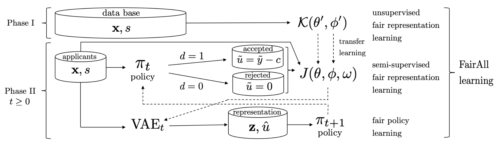
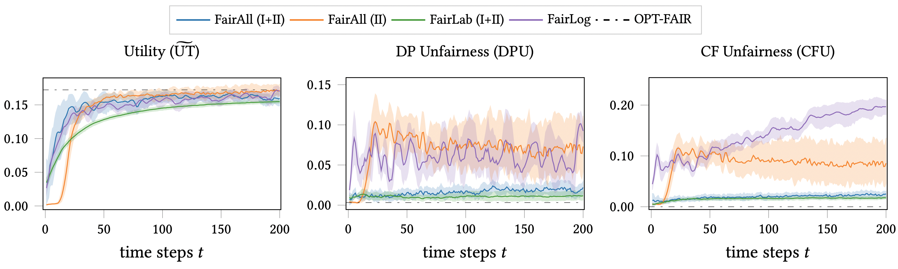
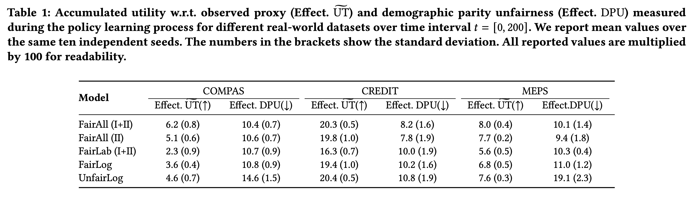
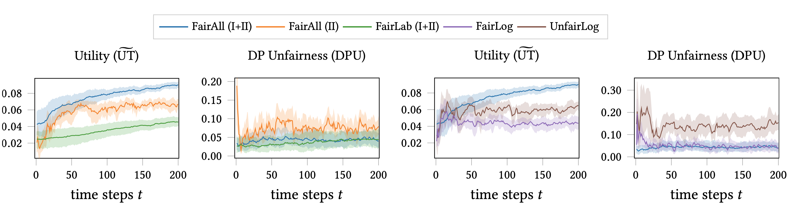
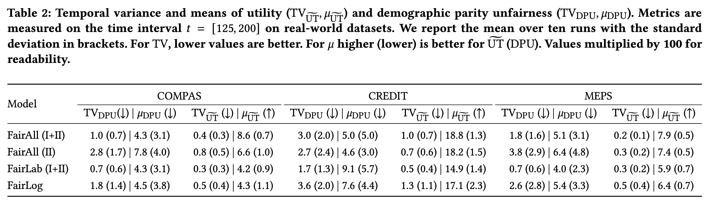

The project is part of our [ACM FAccT 2022](https://facctconference.org/2022/index.html) paper.
In this work, we explore the helpfulness of integrating unlabeled data into the fair decision-making pipeline to tackle label and selection bias.
Although many works exist on trying to learn decision policies that are fair, they often suffer from high variance and instability in these scenarios.
So, when i) the labels we work with are biased (and often biased proxies) and ii) the labeled data is sampled non-i.i.d. with selection bias, 
the prior work often is quite unstable.
By this, we mean that the different policies output by the existing frameworks at different times can give very different
measures of utility and fairness for the same population.
What is more, these policies often forcefully trade-off the utility for gaining fairness.
In this project, we show how we can actually approximate hidden ground-truth information (e.g., talent) from observed biased proxy labels (e.g., biased grades) that can help make optimal and fair decisions (e.g., accept or reject students).
Further, we highlight the role that unlabeled data can play in learning decision policies that are optimal, fair and stable.
## A. Learning fair representations from all data with VAEs
We first aim to use both labeled and unlabeled data in the learning process.
Our goal is to approximate the hidden ground-truth label (e.g., the hidden, intrinsic talent of students) from biased features and proxy labels (e.g., biased grades).
We do so by modeling the data distribution using both labeled and unlabeled data (which is often discarded).
We use a VAE model, conditional on sensitive features (e.g., gender).
Our loss function is shown here. Note, we also have an additional classifier model to predict the true utility of each data-point.
One important point to note: while prior work required IPS weighting to reduce selection bias on the entire loss function,
we need the IPS only for the classifier and not the VAE.
$$
\begin{align}
J(\theta, \phi, \omega) = &\underbrace{\alpha \mathbb{E}\_{(x,\tilde{u}, s)\sim \mathbf{A}^L} \[\mathcal{R}(\omega; x, s, \tilde{u}, \pi)\]}\_{\text{IPS-weighted Classifier}} \\\\
&-\underbrace{\mathbb{E}\_{(x,\tilde{u},s)\sim \mathbf{A}^L, d=1}\[\mathcal{L}(\theta, \phi; x, s, \tilde{u})\]}\_{\text{Labeled VAE-ELBO}} \\\\
&-\underbrace{\mathbb{E}\_{x,s\sim \mathbf{A}^{UL}, d=0}\[\mathcal{U}(\theta, \phi; x, s)\]}\_{\text{Unlabeled VAE-ELBO}}
\end{align}
$$

## B. FairAll: Two-phase decision learning pipeline
We introduce a two-phase decision learning approach that can significantly reduce the instability, while being highly optimal and fair.
In fact, in certain scenarios where an unbiased ground-truth actually might exist, we completely do away with the trade-off that is usually assumed.
Before we actually perform the decision learning phase (Phase II), we introduce a pre-learning Phase I.
In this Phase I, we train a Conditional VAE only on the features. We show that this improves the representation learning and the corresponding stability, optimality, and fairness.

## C. FairAll approximates the hidden ground-truth
Here, we show our result where we use synthetic data (with access to ground-truth information) to show that FairAll can 
approximate the optimal policy based on the ground-truth. 
This is shown by the blue line where we trained FairAll with Phases I and II, i.e., FairAll (I+II).
FairAll (I+II) achieves optimality not only in terms of utility, but also fairness **both** in terms of 
demographic parity (DP) and counterfactual (CF) fairness notions. 
The prior work (FairLog) fails to achieve optimal fairness.
We further show the benefit of unlabeled data, as we compare to our method without Phase I unlabeled data (FairAll (II)), 
and our method with Phase I but without Phase II unlabeled data (FairLog).

## D. FairAll provides an effective and fair learning process
Using real-world data, we show that over the entire training process across time, FairAll can accumulate 
higher amount of utility, **while also** incurring lower amount of unfairness.
This is in stark contrast to prior approach FairLog, where we clearly see a trade-off. 
Note again, the benefits of using unlabeled data in both phases as FairAll (I+II) has the best performance overall.

## E. FairAll provides high utility and fairness for real data
We show that FairAll, on deployment to unseen real-world data, can provide high utility as well as low unfairness.
So, we do not see a trade-off in performance for the policy system, compared to prior method FairLog.
In fact, for COMPAS data as shown here, FairAll can provide utility higher than the unfair standard policy learning method (UnfairLog)!
Using unlabeled data (compared to FairAll (II) and FairLab) also provides higher utility and fairness.

## F. FairAll provides a more stable policy
With real-world data, we show that FairAll (I+II), using unlabeled data in both phases, can indeed provide a more stable policy.
This means that once the learning process has been given some time-steps to learn, FairAll (I+II) can give more stable utility 
and fairness responses with respect to the same unseen test data across different time-steps.
In contrast, prior work like FairLog can give very different estimates.
We measure this variance using Temporal Variance (TV) for utility and fairness.
So, we measure the variance of a metric $M$ across time $t$ with respect to the mean value $\mu_M$.
$$
\operatorname{TV}\_{M}\left(\Pi\_{t\_{1}}^{t\_{2}}\right)=\sqrt{\frac{1}{t\_{2}-t\_{1}} \sum_{t=t\_{1}}^{t\_{2}}\left\[\left(M\left(\pi_{t}\right)-\mu_{M}\right)^{2}\right\]}
$$
where $\mu_M = \frac{1}{t\_2 - t\_1} \sum\_{t=t\_1}^{t\_2} M(\pi\_t)$.
So, lower the TV, more stable the policy process, whereas higher the $\mu$ for utility (lower for unfairness), better the policy.

<b>This project was jointly first-authored with Miriam Rateike. Also done in collaboration with Olga Mineeva, Isabel Valera, Krishna Gummadi.</b>

