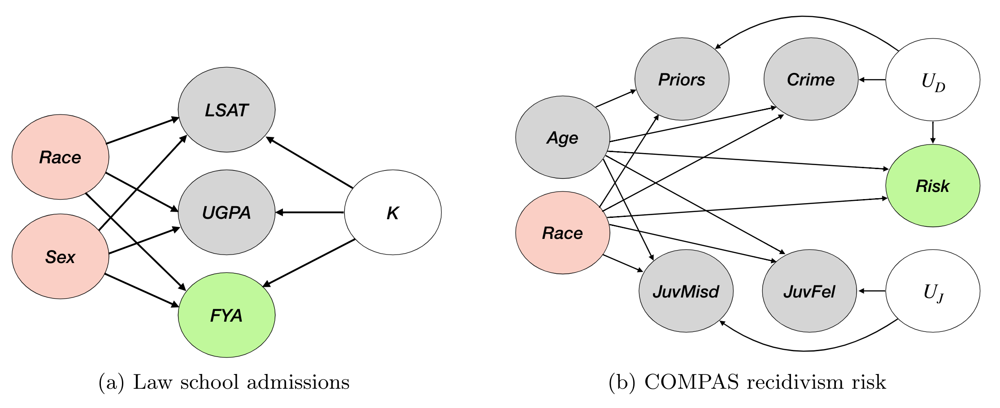
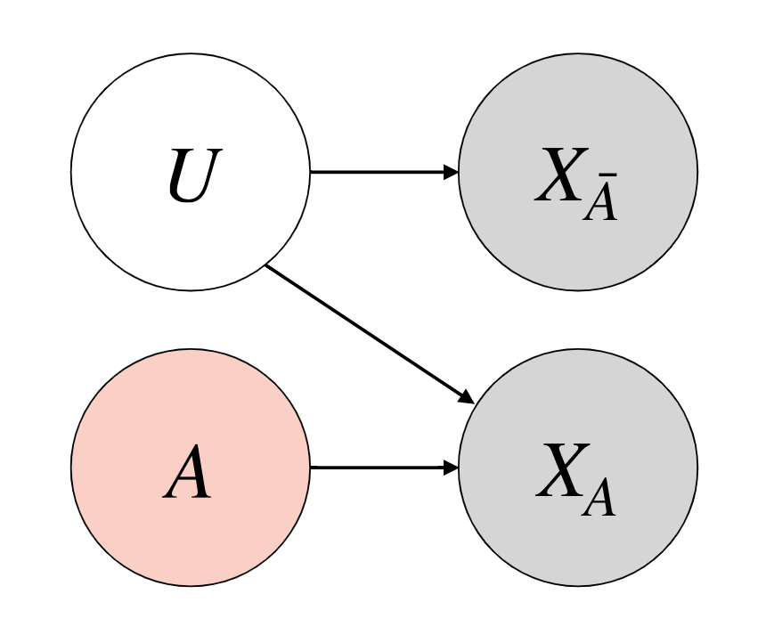
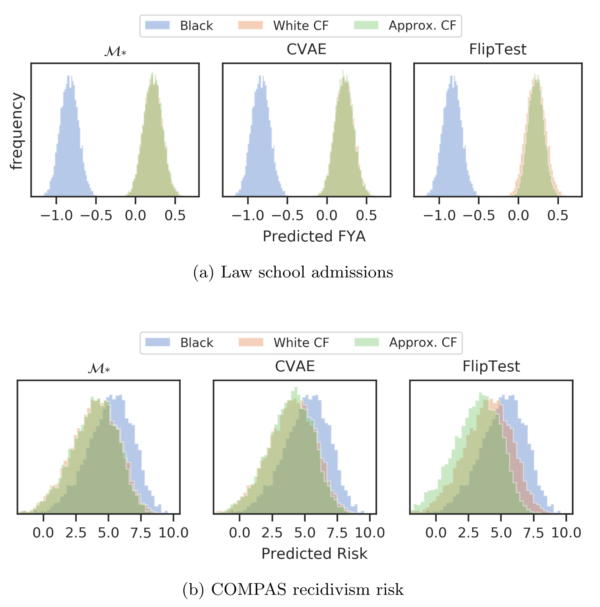
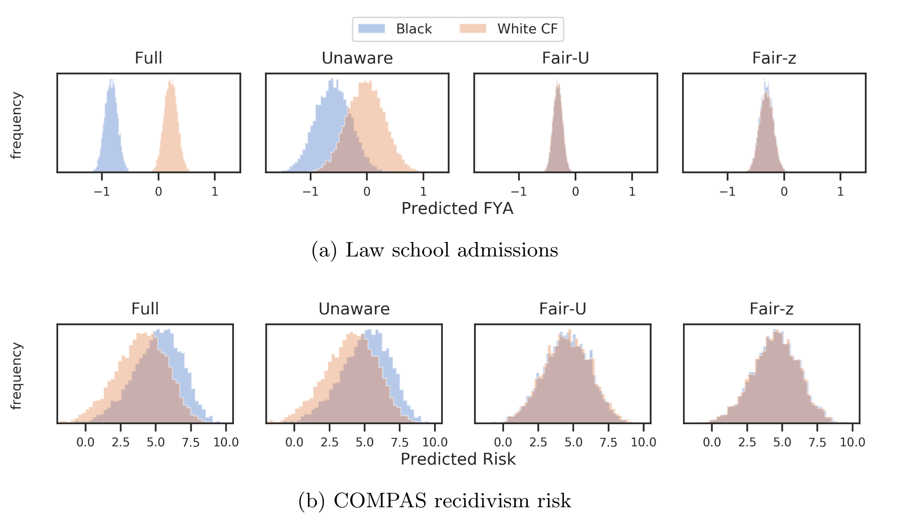

Notions of causal fairness for algorithmic decision making systems crucially rely on estimating whether an individual (or a group of individuals) and their counterfactual individual (or groups of individuals) would receive the same decision(s). Central to this estimation is the ability to compute the features of the counterfactual individual, given the features of any individual. Recent works have proposed to apply deep generative models like GANs and VAEs over real-world datasets to compute counterfactual datasets at the level of both individuals and groups. In this paper, we explore the challenges with computing accurate counterfactuals, particularly over heterogenous tabular data that is often used in algorithmic decision making systems. We also investigate the implicit assumptions when applying deep generative models to compute counterfactual datasets.

## Simplifying causal assumptions
Looking at the fairness and causality literature, we can actually simplify the causal graphs often assumed in the literature.

These graphs considered in fairness literature have implicit structures, that we can leverage to simplify them.
<figure>

<figcaption>Simpler causal graph that we can assume for fairness. Sensitive A is root node along with exogenous U. Some observed features X are affected by A.</figcaption>
</figure>

So, we can almost always assume a simpler causal graph to work with. The main considerations are:
- Sensitive features are root nodes.
- Sensitive features do not influence exogenous variables.
- Some observed features can be affected by sensitive features.

## Using a Conditional VAE to generate counterfactuals
We first model the data likelihood using a Conditional VAE, conditioned on the sensitive features. We minimize the loss:
$$
\mathcal{L}=\frac{1}{N} \sum_{i=1}^{N} \mathbb{E}\_{q\_{\phi}\left(Z \mid X_{i}, A\right)}\left(\frac{\left\|X\_{i}-\hat{X}\_{i}\right\|^{2}}{\sigma^{2}}\right)+\mathbb{D}\_{K L}\left\[q\_{\phi}\left(Z \mid X\_{i}, A\right) \| p(Z)\right\]
$$
where $\sigma$ is a hyperparameter, $q\_\phi$ is the encoder.
Then, we generate counterfactuals as follows:
$$
P\left(X\_{A \leftarrow a^{\prime}}^{c} \mid F\right)=\int p\_{\theta}\left(X^{c} \mid A=a^{\prime}, Z\right) q\_{\phi}(Z \mid F) d Z
$$
So, we perform 3 steps, paralleling Pearl's steps:
1. Infer latent Z from observed features using encoder $q\_\phi$
2. Perform intervention, changing sensitive conditional variable
3. Perform deduction using the Z and changed conditional with decoder $p\_\theta$

## We can use CVAE to audit for counterfactual fairness
We show that we can use the CVAE model to audit prediction models for counterfactual fairness.
Note, how the CVAE generated counterfactuals provide auditing results very close to the oracle model $\mathcal{M}\_*$, that is assumed to have the exact causal graph.
The prior work FlipTest that uses GANs do not give as optimal results as the CVAE.

## We can use CVAE to train counterfactually fair predictors
We next show how we can actually use the latent Z of the CVAE to train prediction models that are *counterfactually fair*.
Note, FlipTest has no immediate way to estimate latent Z from input data, so cannot be directly used here.
CVAE-based Fair-Z is able to give very similar prediction results compared to the actual $U$ values from the true causal graphs. 

<b>This project was done in collaboration with Preethi Lahoti, Junaid Ali, Till Speicher, Isabel Valera and Krishna Gummadi.</b>

