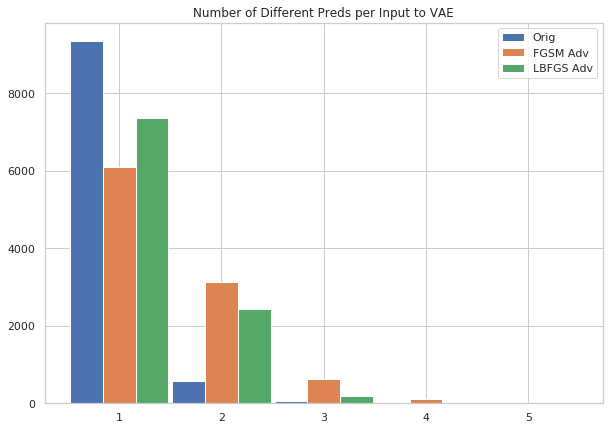
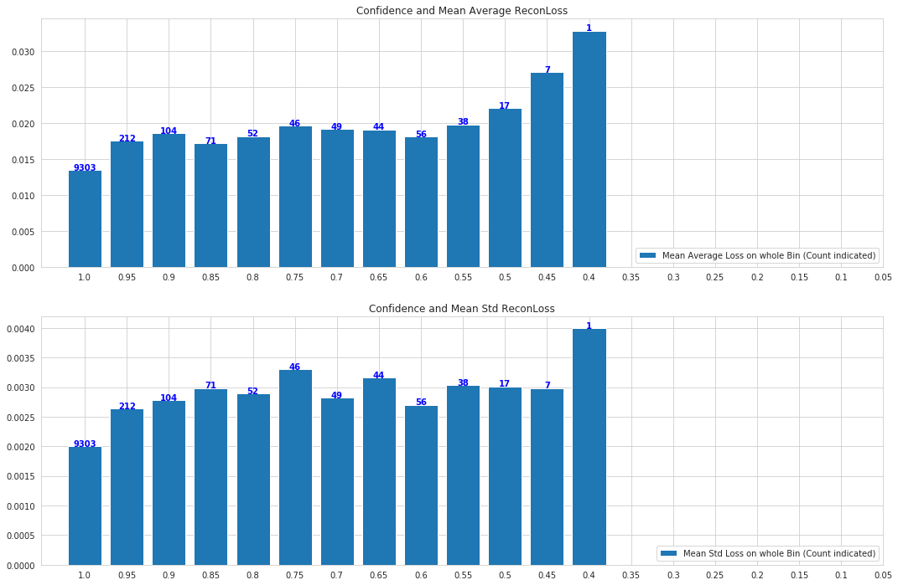

The work explored various directions of robustness, from tackling out of sample data to adversarial attacks and calibrated outputs. 
We explore how we could use the variational autoencoder (VAE) model in such use-cases. 

We look in-depth at the VAE's behavior while tackling out-of-distribution (OOD) samples. 
We analyze the VAE latent distributional space to search for any possible signals we could use.
We also see how VAE reconstructions of the data could actually be used to detect OOD samples.

For adversarial samples, we again explore the VAE latent distributional space.
We additionally look at using the VAE to clean adversarial samples.
The idea is that the VAE would manage to map any adversarial sample back into the nearest point in the data manifold.

Finally, we explore if the VAE could be used to help a model make more calibrated decisions.

## A. Testing Classifier Response to Adversaries with VAE
Using FGSM and LBFGS adversarial attacks, we use the MNIST dataset to generate adversarial examples.
Utilizing the stochasticity of the VAE model, for each input image, we sample 10 different latent z representations, and correspondingly 10 different reconstructions.
Then, we see how consistent the predicted labels for these 10 images are for a trained classifier. Ideally, the classifier response should be consistent.
So, the number of different labels given to the set of 10 images should be 1.
- For the original MNIST images, this is the case. The classifier is almost always consistent.
- But, for adversarial images, the VAE reconstructions are *not always consistent*.
- So, for a lot more instances, the classifier predicts the different images having different labels.

This could potentially be used to detect anomalous data using VAEs.

## B. Testing Classifier Calibration with VAE
Is there a relation between how well the VAE reconstructs an image and a classifier's confidence on the same?
So, would a VAE model reconstruct those images where a classifier would be more confident, in a much better way?
We test this in this experiment. Using MNIST data, for each image we use a trained classifier to check the confidence/probability strength of the classifier's prediction.
We also check the VAE reconstruction loss (standard pixel-wise MSE loss) for each image.
If the VAE can be used to test calibration, then low VAE reconstruction loss should correspond to high confidence in the classifier.
- We indeed see this. For images with high confidence, the VAE reports much lower loss.
- The loss slowly increases as the confidence reduces.
- But, we note that the signal here is not as strong.

Hence, using a VAE to test calibration would require further research.

**This project was done as a research assistant at the Max-Planck Institute for Software Systems.**
